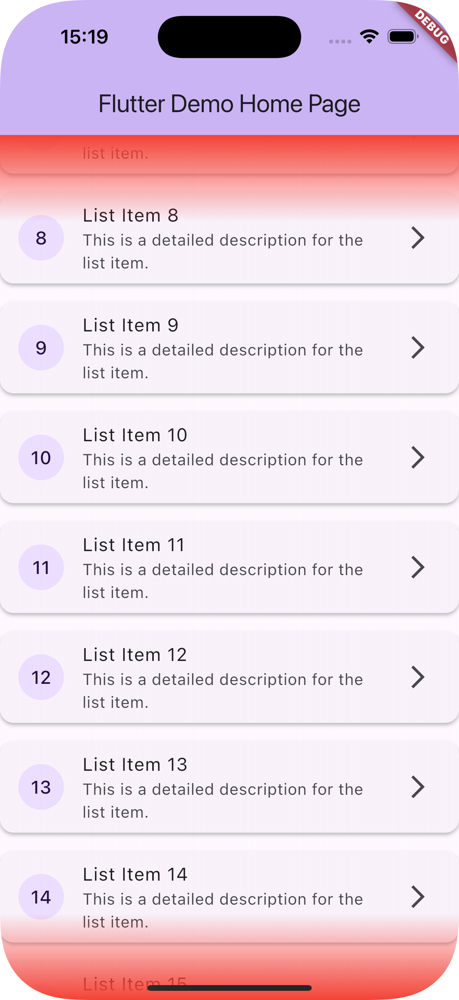

# gradient_list_view

[](https://pub.dev/packages/gradient_list_view)
[](https://opensource.org/licenses/MIT)


<table width="100%">
  <tr>
    <td width="50%" align="center">
      
      <br>
    </td>
    <td width="50%" align="center">
      <a href="video/example.mp4">
        
      </a>
      <br>
    </td>
  </tr>
</table>

`gradient_list_view` is a Flutter package that provides a simple yet effective way to add a gradient fade effect to the top and bottom of any scrollable widget. This creates a visually pleasing effect where content appears to blend seamlessly into the background, especially useful for long lists or scrollable areas.

## Features

-   **Easy Integration**: Wrap any scrollable widget (`ListView`, `GridView`, `SingleChildScrollView`, etc.) with `GradientListView`.
-   **Customizable Gradients**: Full control over gradient colors, stops, begin/end alignments, and even fixed height.
-   **Non-blocking**: The gradient overlay does not block pointer events, allowing users to interact with the underlying list items.

```dart 
    GradientListView(
        gradientColors: [
            Colors.red,
            Colors.red.withValues(alpha: .0),
            Colors.red.withValues(alpha: .0),
            Colors.red.withValues(alpha: .0),
            Colors.red,
        ],
        gradientStops: const [0.0, 0.1, 0.5, 0.9, 1.0],
        // gradientHeight: 200,
        child: ListView.builder(
            itemCount: 100,
            itemBuilder: (context, index) {
            return Card(
                margin: const EdgeInsets.symmetric(vertical: 8.0),
                elevation: 2,
                child: ListTile(
                leading: CircleAvatar(child: Text('${index + 1}')),
                title: Text('List Item ${index + 1}'),
                subtitle: const Text(
                    'This is a detailed description for the list item.',
                ),
                trailing: const Icon(Icons.arrow_forward_ios),
                onTap: () {
                    ScaffoldMessenger.of(context).showSnackBar(
                    SnackBar(
                        content: Text('Tapped on Item ${index + 1}'),
                    ),
                    );
                },
                ),
            );
            },
        ),
    )
```
## Installation

Add this to your `pubspec.yaml` file:

```yaml
dependencies:
  gradient_list_view: ^0.1.0